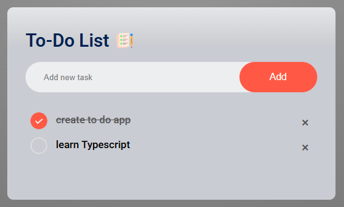

# 📝 To-Do List Application

## Live Demo - https://akmalov11c.github.io/todo-list/

## 📋 Overview
A beautifully designed and functional To-Do List application to manage your tasks effectively. Built with modern web technologies, this app offers a clean interface and seamless user experience with persistent task storage.

---

## ✨ Features
- ✅ **Add Tasks**: Quickly add new tasks with ease.
- 🖊️ **Mark as Complete**: Toggle tasks between completed and active states.
- ❌ **Remove Tasks**: Delete tasks instantly by clicking the delete icon.
- 💾 **Persistent Storage**: Keeps your tasks saved in the browser using `localStorage`.

---

## 🖥️ Technologies Used
- 🌐 **HTML**: For creating the structure of the app.
- 🎨 **CSS**: For styling and enhancing the UI/UX.
- ⚡ **JavaScript**: For interactive features and data handling.

---

## 🚀 How to Use

1. Clone the repository to your local machine:
   
   ```bash
   git clone https://github.com/your-username/todo-list-app.git
   cd todo-list-app
2. Open the index.html file in any modern web browser to start using the app.

## 📷 Screenshots

### Overview   
  

## 🔧 Customization

Feel free to personalize the app:

 - 🎨 Design: Update style.css to change the look and feel.
 - ⚙️ Functionality: Modify script.js to add or adjust features.

## 🌟 What You'll Learn

1. Building dynamic user interfaces with JavaScript.
2. Using localStorage for data persistence.
3. Structuring a project for readability and scalability.

## 🤝 Contributions

Contributions are welcome! If you have suggestions or ideas for improvement:

1. Fork the repository.
2. Make your changes.
3. Submit a pull request.

## 📜 License

This project is licensed under the MIT License.
Feel free to use and modify it for your own purposes!

🎉 Start building your own To-Do List app today!
